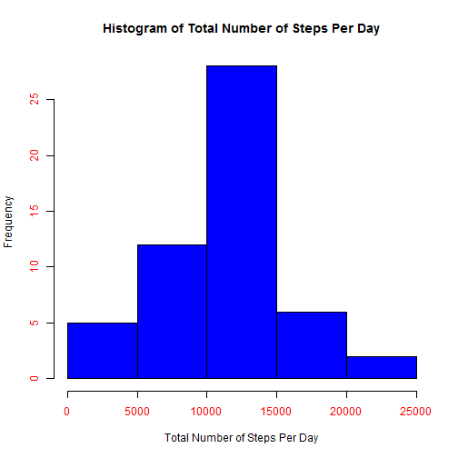
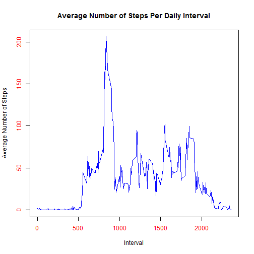
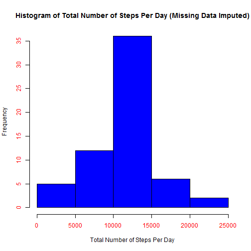
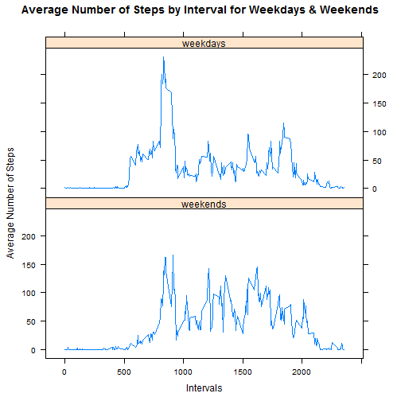

#Assignment 1

**Course: Reproducible Research**

**Student: Nnaemeka Akpunonu**

**Due Date: Sunday, July 20, 2014**


###Task 1: Loading and preprocessing the data

**1. Load the data**

&nbsp;&nbsp;&nbsp;&nbsp;&nbsp; I used the following code to load the data from a folder in my working directory:


```r
actdata <- read.csv("C:/Users/nakpunonu/Google Drive/Courses Online/R Programming/R Working Directory/activitydata/activity.csv")
```


**2. Process/transform the data (if necessary) into a format suitable for your analysis**

&nbsp;&nbsp;&nbsp;&nbsp;&nbsp; I did not find any need to preprocess the data

###Task 2: What is mean total number of steps taken per day?

**1. Make a histogram of the total number of steps taken each day (ignore missing values)**

&nbsp;&nbsp;&nbsp;&nbsp;&nbsp; I used the following code to draw the histogram:


```r
steps.per.day <- tapply(actdata$steps,actdata$date,sum)

hist(steps.per.day, col="blue", xlab="Total Number of Steps Per Day", main = "Histogram of Total Number of Steps Per Day",col.axis="red")
```

 

- As the histogram shows, the total number of steps per day for this individual falls between 0 to 25,000 steps; and mostly falls between 10,000 to 15,000 steps.

**2. Calculate and report the mean and median total number of steps taken per day.**

&nbsp;&nbsp;&nbsp;&nbsp;&nbsp; I used the following code to compute the mean and the median:


```r
mean.total.steps <- mean(steps.per.day,na.rm=T)
mean.total.steps
```

```
## [1] 10766
```

```r
median.total.steps <- median(steps.per.day,na.rm=T)
median.total.steps
```

```
## [1] 10765
```

- The mean total number of steps per day is 1.0766 &times; 10<sup>4</sup> steps
- The median total number of steps per day is 10765 steps

###Task 3: What is the average daily activity pattern?

**1. Make a time series plot of the 5-minute interval (x-axis) and the average number of steps taken, averaged across all days (y-axis)**

&nbsp;&nbsp;&nbsp;&nbsp;&nbsp; I used the following code to perform this action:


```r
avg.steps.per.int <- tapply(actdata$steps,actdata$interval,mean,na.rm=T)
intervals <- unique(actdata$interval)
table3 <- data.frame(interval=intervals,Avg.Steps = avg.steps.per.int)
plot(table3$interval,table3$Avg.Steps,type="l",col="blue",col.axis="red",xlab="Interval",ylab="Average Number of Steps", main = "Average Number of Steps Per Daily Interval")
```

 

**2. Which 5-minute interval, on average across all the days in the dataset, contains the maximum number of steps?**

&nbsp;&nbsp;&nbsp;&nbsp;&nbsp; I used the following code to perform this action:


```r
table3$Avg.Steps <- as.numeric(table3$Avg.Steps)
max.step <- round(max(table3$Avg.Steps),0)
maximum <- table3$Avg.Steps==max(table3$Avg.Steps)
max.int <- table3$interval[maximum]
max.int
```

```
## [1] 835
```

- The 5-minute interval with the maximum number of steps is interval 835. It contains an average of 206 steps.

### Task 4: Imputing missing values

**1. Calculate and report the total number of missing values in the dataset (i.e. total number of rows with NA's)**

&nbsp;&nbsp;&nbsp;&nbsp;&nbsp; I used the following code to perform this action:


```r
count.of.NA <- sum(is.na(actdata$steps))
count.of.NA
```

```
## [1] 2304
```

- The total number of rows which contain NA is 2304.

**2. Devise a strategy to fill in all missing values in the dataset.**

- I opted to fill them in with the mean for the interval.

**3. Create a new dataset that is equal to the original dataset but with the missing data filled in.**

&nbsp;&nbsp;&nbsp;&nbsp;&nbsp; I used the following code to perform this action. I also included the head and the summary of the new dataset.


```r
new.actdata <- read.csv("C:/Users/nakpunonu/Google Drive/Courses Online/R Programming/R Working Directory/activitydata/activity.csv")

for(i in 1:nrow(new.actdata)){
        if(is.na(new.actdata[i,1])){
                
                new.actdata[i,1] <- table3$Avg.Steps[match(new.actdata[i,3],table3$interval)]
                
        }
}

head(new.actdata)
```

```
##     steps       date interval
## 1 1.71698 2012-10-01        0
## 2 0.33962 2012-10-01        5
## 3 0.13208 2012-10-01       10
## 4 0.15094 2012-10-01       15
## 5 0.07547 2012-10-01       20
## 6 2.09434 2012-10-01       25
```

```r
summary(new.actdata)
```

```
##      steps               date          interval   
##  Min.   :  0.0   2012-10-01:  288   Min.   :   0  
##  1st Qu.:  0.0   2012-10-02:  288   1st Qu.: 589  
##  Median :  0.0   2012-10-03:  288   Median :1178  
##  Mean   : 37.4   2012-10-04:  288   Mean   :1178  
##  3rd Qu.: 27.0   2012-10-05:  288   3rd Qu.:1766  
##  Max.   :806.0   2012-10-06:  288   Max.   :2355  
##                  (Other)   :15840
```

**4. Make a histogram of the total number of steps taken each day and calculate and report the mean and median total number of steps taken per day. Do these values differ from the estimates from the first part of the assignment? What is the impact of imputing missing data on the estimates of the total daily number of steps?**

&nbsp;&nbsp;&nbsp;&nbsp;&nbsp; I used the following code to perform this action:


```r
new.steps.per.day <- tapply(new.actdata$steps,new.actdata$date,sum)
hist(new.steps.per.day, col="blue", xlab="Total Number of Steps Per Day", main = "Histogram of Total Number of Steps Per Day (Missing Data Imputed)",col.axis="red")
```

 


```r
new.mean.total.steps <- mean(new.steps.per.day,na.rm=T)
new.mean.total.steps
```

```
## [1] 10766
```

```r
new.median.total.steps <- median(new.steps.per.day,na.rm=T)
new.median.total.steps
```

```
## [1] 10766
```

- The new mean total steps per day is 1.0766 &times; 10<sup>4</sup> (with missing data imputed) compared to 1.0766 &times; 10<sup>4</sup> without missing data imputed. 

- The new median total steps per day is 1.0766 &times; 10<sup>4</sup> (with missing data imputed) compared to 10765 without missing data imputed.

- As can be seen above, imputing missing data by using the average across respective intervals in this instance does not make any considerable difference to the analysis.

### Task 5: Are there differences in activity patterns between weekdays and weekends?

**1. Create a new factor variable in the dataset with two levels - 'weekday' and 'weekend' indicating whether a given date is a weekday or weekend day.**

&nbsp;&nbsp;&nbsp;&nbsp;&nbsp; I used the following code to perform this action. A sample of the output dataset with the weekdays and weekday factors is shown. "1"" is used to represent weekends while "2" represents weekdays.


```r
new.actdata2 <- data.frame(new.actdata)
new.actdata2$date <- as.POSIXlt(new.actdata2$date)
weekday <- weekdays(new.actdata2$date)

weekday.factor <- data.frame(weekday.factor = 1:nrow(new.actdata2))

for(i in 1:nrow(new.actdata2)){
        if(weekday[i]=="Sunday" | weekday[i]=="Saturday"){
                weekday.factor[i,1] <- 1
                } else {
                       weekday.factor[i,1] <- 2
                }      
}

weekday.factor$weekday.factor <- as.factor(weekday.factor$weekday.factor)
factor.labels <- factor(weekday.factor, levels=c(1,2), labels=c("weekends","weekdays"))

new.actdata2 <- data.frame(new.actdata2, weekday, weekday.factor)

new.actdata2[2010:2020,]
```

```
##       steps       date interval weekday weekday.factor
## 2010 0.0000 2012-10-07     2325  Sunday              1
## 2011 0.0000 2012-10-07     2330  Sunday              1
## 2012 0.0000 2012-10-07     2335  Sunday              1
## 2013 0.0000 2012-10-07     2340  Sunday              1
## 2014 0.0000 2012-10-07     2345  Sunday              1
## 2015 0.0000 2012-10-07     2350  Sunday              1
## 2016 0.0000 2012-10-07     2355  Sunday              1
## 2017 1.7170 2012-10-08        0  Monday              2
## 2018 0.3396 2012-10-08        5  Monday              2
## 2019 0.1321 2012-10-08       10  Monday              2
## 2020 0.1509 2012-10-08       15  Monday              2
```

**2. Make a panel plot containing a time series plot of 5-minute intervals and the average number of steps taken, averaged across all weekday days or weekend days.**

&nbsp;&nbsp;&nbsp;&nbsp;&nbsp; I used the following code to perform this action.


```r
factor.avg <- tapply(new.actdata2$steps,list(new.actdata2$interval,new.actdata2$weekday.factor),mean,na.rm=T,simplify=TRUE)

int <- new.actdata2[1:576,3]
factor <- factor(rep(1:2,each=288),levels=c(1,2),labels=c("weekends","weekdays"))
table5<- data.frame(steps = c(factor.avg[1:288,1],factor.avg[1:288,2]),factor=factor,interval=int)

library(lattice)

xyplot(table5$steps~table5$interval | table5$factor, data = table5, type= "l",layout=c(1,2),xlab="Intervals",ylab="Average Number of Steps",main="Average Number of Steps by Interval for Weekdays & Weekends")
```

 
